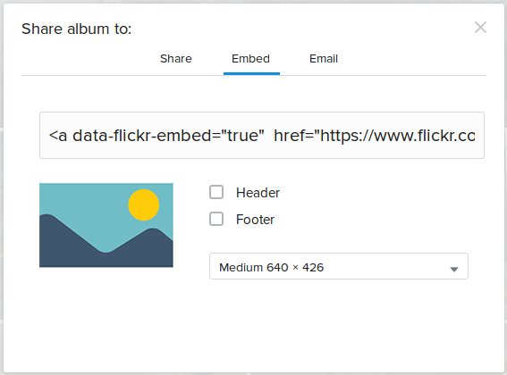

# Naturschutz-Richterswil-Samstagern.github.io
Website for [Naturschutz Richterswil-Samstagern](http://naturschutz-richterswil-samstagern.github.io/)

## Bildergrössen

* Homepage 4 Kategorien: `458px * 200px`
* Headerimages: `950px * 250px`
* Leadimage News: `150px * 200px`
* Bilder Seite (iframes von flickr): `950px x 712px`
* Portraits "Über Uns" `270px x 406px` 

## Newsbeitrag hinzufügen

1. Neue Datei in Ordner `/_posts/` anlegen mit dem Dateiname: `YYYY-MM-DD-url-pfad-der-angezeigt-werden-soll.md` (am besten eine bestehende Datei kopieren).
2. In der News-Datei im Header die Attribute `date:` und `image:` setzen. Das `image:` wird auf der Übersichtsseite aller Newsartikel angezeigt. Das Bild im Ordner `/images/news/` ablegen.
3. Bilder können innerhalb des Artikels fliessen links oder rechts dargestellt werden. HTML Code dafür:
  * Links: ``
  * Rechts: ``

## Bildergalerie hinzufügen

Bilder werden nicht direkt in diesem Projekt abgelegt, sondern via [Flickr](https://www.flickr.com/) Alben eingebunden.

Eine neue Bildergalerie kann wie folgt eingefügt werden:

0. [GitHub Benutzerkonto erstellen](https://github.com/join), E-Mail Benachrichtigung bestätigen, Für das Bearbeiten dieses Projektes freischalten lassen.
1. [Flickr Benutzerkonto erstellen](https://login.yahoo.com/account/create)
2. [Flickr Album erstellen](https://de.hilfe.yahoo.com/kb/SLN22155.html#cont1) und Bilder hochladen.
3. In der Flickr Albumansicht auf den **Album Teilen** Pfeil klicken , dort den Tab **Embed** auswählen und die Codezeile in die Zwischenablage kopieren. Die Codzeile beginnt mit ``<a data-flickr-embed="true"  href="https://www.flickr.com/...` <br> 
4. Auf [prose.io](http://prose.io/) anmelden und in der Datei `/_pages/bilder.md` einen neuen Bildergalerie Block hinzufügen.

### Bildergalerie Block

Ein Bildergalerie Block in der Datei `/_pages/bilder.md` besteht aus drei Elementen:

1. **Dem Titel**: `## Titel, Monat Jahr`, z.B. `## Heckenpflanzung, März 2015`
2. **Dem Flickr embed code**, der auf Flicker im Album zu finden ist (siehe oben). Wichtig ist, dass in diesem Block die Breite (width) und Höhe (height) des Vorschaubildes auf `width="950" height="712"` geändert werden, nachdem der embed code von Flickr kopiert wurde: `<a data-flickr-embed="true"  href="https://www.flickr.com/photos/144980889@N08/albums/72157670783671176" title="2015-04-11 Heckenpflanzung"></a><script async src="//embedr.flickr.com/assets/client-code.js" charset="utf-8"></script>`
3. **Dem Button um direkt zur Bildergaliere auf Flick zu gelangen**. Hier muss der Link zur Gallerie auf Flickr in `[LINK-ZUR-BILDERGALIERE-AUF-FLICKR]` eingetragen werden. Der Code dazu ist: `<a class="button expanded" href="[LINK-ZUR-BILDERGALIERE-AUF-FLICKR]">&#10095; zur Bildergalerie</a>`

## Beispiel eines funktionierenden Bildergalerie Blocks

```markdown
## Heckenpflanzung, März 2015

<a data-flickr-embed="true"  href="https://www.flickr.com/photos/144980889@N08/albums/72157670783671176" title="2015-04-11 Heckenpflanzung"></a><script async src="//embedr.flickr.com/assets/client-code.js" charset="utf-8"></script>

<a class="button expanded" href="https://www.flickr.com/gp/144980889@N08/8aMwWF">&#10095; zur Bildergalerie</a>
```

## Entwicklungsumgebung installieren

* [Foundation](http://foundation.zurb.com/sites/docs/installation.html#command-line-tool.html) (npm install der Version `v1.0.4`)
* [Jekyll](http://jekyllrb.com/) (`v1.4.2`)

## run development

### build sass to css
`npm start`

### run jekyll server on port 4000
`jekyll serve -w`
